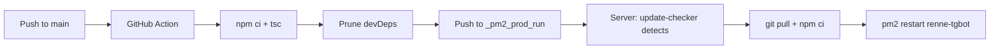

# Renne Telegram Bot

A TypeScript Telegram bot with torrent downloads, media conversion, and image search.

## Features

| Feature | Description |
|---------|-------------|
| 📥 Torrent | Download from magnet link or .torrent file, auto-upload to Telegram |
| 🖼 Image | Convert to GIF, Google Lens search, Yandere reverse search |
| 🎬 Video | Convert to GIF |
| 🎞 GIF | Convert to video or extract frame |
| 🔗 URL Fixer | Auto-fix x.com → fixupx.com links |
| 📦 Smart ZIP | Compress >2GB folders automatically |

## Setup

```bash
# Install dependencies
npm install

# Install ffmpeg (required for video conversion)
# macOS
brew install ffmpeg
# Ubuntu
sudo apt install ffmpeg

# Configure
cp .env.example .env
# Edit .env with your bot token

# Run
npm run dev
```

## Commands

- `/start` — Brief info
- `/help` — Full command list
- `/bt` — Start torrent download
- Send `.torrent` or magnet link directly

## Architecture

```
src/
├── bot.ts              # Entry point
├── commands/           # Bot commands
│   ├── start.ts
│   ├── help.ts
│   └── bt.ts
├── handlers/           # Content handlers
│   ├── image.ts
│   ├── video.ts
│   ├── gif.ts
│   ├── torrent.ts
│   └── url.ts
├── modules/            # Core logic
│   ├── torrent.ts      # WebTorrent download
│   ├── media.ts        # Image/video conversion
│   ├── search.ts       # Image search
│   └── zipper.ts       # ZIP compression
└── utils/              # Helpers
    ├── constants.ts
    ├── progress.ts     # Progress message updates
    └── tg.ts           # Telegram utilities
```

## Torrent Download Flow

1. User sends torrent/magnet → bot crawls file info
2. If single file ≤ 2GB → download & upload directly
3. If images → download & send (compressed + uncompressed)
4. If >2GB folder → download & ZIP, then send ZIP
5. Progress message updates in real-time

## Requirements

- Node.js ≥ 18
- ffmpeg (for video/gif conversion)
- Telegram Bot Token

## Production Deployment

This project uses a **two-branch workflow**:

| Branch | Purpose |
|--------|---------|
| `main` | TypeScript source code |
| `_pm2_prod_run` | Compiled JS + production runner |

### How It Works



1. Push to `main` → GitHub Action compiles TS, pushes artifacts to `_pm2_prod_run`
2. On the server, `renne-updater` (pm2) polls `_pm2_prod_run` every 60s
3. If new commit detected → `git pull` → `npm ci` → `pm2 restart renne-tgbot`

### Initial Server Setup (Synology NAS)

**1. Install DSM packages**

Open **Package Center** → Install:
- **Git Server** (or just Git)
- **Node.js** (via Synology Package Center — look for v18+)

If Node.js isn't available in Package Center, use [SynoCommunity](https://synocommunity.com/):
```bash
# Add SynoCommunity package source in Package Center
# Then install Node.js and ffmpeg from there
```

**2. Install ffmpeg**

Option A — SynoCommunity (recommended):
- Install `ffmpeg` package from SynoCommunity

Option B — Manual:
```bash
cd /tmp
wget https://johnvansickle.com/ffmpeg/releases/ffmpeg-release-amd64-static.tar.xz
tar xf ffmpeg-release-amd64-static.tar.xz
sudo cp ffmpeg-*/ffmpeg /usr/local/bin/
sudo cp ffmpeg-*/ffprobe /usr/local/bin/
```

Verify:
```bash
ffmpeg -version | head -1
```

**3. SSH into your NAS and clone the production branch**

```bash
ssh admin@your-nas-ip

# Create directory
mkdir -p /volume1/docker/renne-bot

# Clone production branch (contains compiled JS + runner)
git clone -b _pm2_prod_run https://github.com/lenchan139/renne-tgbot.git /volume1/docker/renne-bot
cd /volume1/docker/renne-bot
```

**4. Configure environment**

```bash
# Create .env from example
cp .env.example .env

# Edit with vi (nano may not be available on DSM)
vi .env
```

`.env` contents:
```
BOT_TOKEN=your_telegram_bot_token_here
```

> Get a bot token from [@BotFather](https://t.me/BotFather)

**5. Run the bootstrap script**

```bash
bash scripts/prod-start.sh
```

This will:
- Install pm2 globally (if missing)
- Install production npm dependencies
- Start both `renne-tgbot` and `renne-updater` processes

**6. Verify everything is running**

```bash
pm2 status
```

You should see:
```
renne-tgbot   ● online  0s  0 MB  enabled
renne-updater ● online  0s  0 MB  enabled
```

---

### What happens after setup?

- The **bot** runs continuously and responds to Telegram messages
- The **updater** checks `_pm2_prod_run` branch every 60 seconds
- When you push to `main`, GitHub Actions builds and pushes to `_pm2_prod_run`
- The updater detects the new commit, pulls it, runs `npm ci`, and restarts the bot
- **Zero manual intervention** required for updates

---

### Server Requirements (Synology)

| Requirement | How to Install |
|-------------|---------------|
| Node.js ≥ 18 | Package Center or [SynoCommunity](https://synocommunity.com/) |
| ffmpeg | SynoCommunity package or [johnvansickle static build](https://johnvansickle.com/ffmpeg/) |
| Git | DSM Package Center → Git Server |
| pm2 | auto-installed by `prod-start.sh` |

### Useful Commands

```bash
pm2 status              # Check process status
pm2 logs                # View live logs
pm2 logs renne-tgbot    # Bot logs only
pm2 logs renne-updater  # Updater logs only
pm2 restart all          # Restart everything
pm2 stop all            # Stop everything
```
