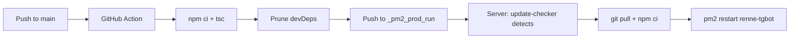

# Renne Telegram Bot

A TypeScript Telegram bot with torrent downloads, media conversion, and image search.

## Features

| Feature | Description |
|---------|-------------|
| 📥 Torrent | Download from magnet link or .torrent file, auto-upload to Telegram |
| 🖼 Image | Convert to GIF, Google Lens search, Yandere reverse search |
| 🎬 Video | Convert to GIF |
| 🎞 GIF | Convert to video or extract frame |
| 🔗 URL Fixer | Auto-fix x.com → fixupx.com links |
| 📦 Smart ZIP | Compress >2GB folders automatically |

## Setup

```bash
# Install dependencies
npm install

# Install ffmpeg (required for video conversion)
# macOS
brew install ffmpeg
# Ubuntu
sudo apt install ffmpeg

# Configure
cp .env.example .env
# Edit .env with your bot token

# Run
npm run dev
```

## Commands

- `/start` — Brief info
- `/help` — Full command list
- `/bt` — Start torrent download
- Send `.torrent` or magnet link directly

## Architecture

```
src/
├── bot.ts              # Entry point
├── commands/           # Bot commands
│   ├── start.ts
│   ├── help.ts
│   └── bt.ts
├── handlers/           # Content handlers
│   ├── image.ts
│   ├── video.ts
│   ├── gif.ts
│   ├── torrent.ts
│   └── url.ts
├── modules/            # Core logic
│   ├── torrent.ts      # WebTorrent download
│   ├── media.ts        # Image/video conversion
│   ├── search.ts       # Image search
│   └── zipper.ts       # ZIP compression
└── utils/              # Helpers
    ├── constants.ts
    ├── progress.ts     # Progress message updates
    └── tg.ts           # Telegram utilities
```

## Torrent Download Flow

1. User sends torrent/magnet → bot crawls file info
2. If single file ≤ 2GB → download & upload directly
3. If images → download & send (compressed + uncompressed)
4. If >2GB folder → download & ZIP, then send ZIP
5. Progress message updates in real-time

## Requirements

- Node.js ≥ 18
- ffmpeg (for video/gif conversion)
- Telegram Bot Token

## Production Deployment

This project uses a **two-branch workflow**:

| Branch | Purpose |
|--------|---------|
| `main` | TypeScript source code |
| `_pm2_prod_run` | Compiled JS + production runner |

### How It Works



1. Push to `main` → GitHub Action compiles TS, pushes artifacts to `_pm2_prod_run`
2. On the server, `renne-updater` (pm2) polls `_pm2_prod_run` every 60s
3. If new commit detected → `git pull` → `npm ci` → `pm2 restart renne-tgbot`

### Initial Server Setup

```bash
# Clone the production branch
git clone -b _pm2_prod_run <repo-url> /opt/renne-bot
cd /opt/renne-bot

# Set your bot token
cp .env.example .env
nano .env

# Run the bootstrap script
bash scripts/prod-start.sh
```

### Server Requirements

- Node.js ≥ 18
- ffmpeg (`sudo apt install ffmpeg`)
- Git
- pm2 (installed automatically by `prod-start.sh`)

### Useful Commands

```bash
pm2 status              # Check process status
pm2 logs                # View live logs
pm2 logs renne-tgbot    # Bot logs only
pm2 logs renne-updater  # Updater logs only
pm2 restart all          # Restart everything
pm2 stop all            # Stop everything
```
